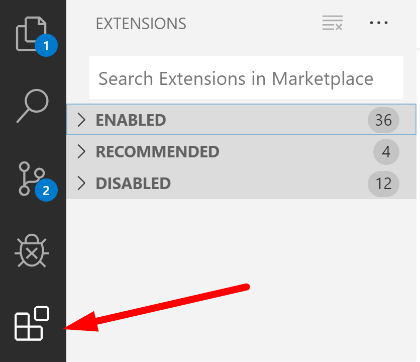
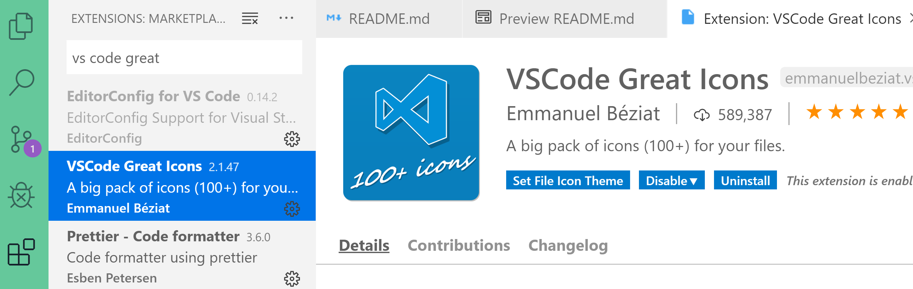

# Chapter 1: Lab 1 - Navigating VS Code, Markdown files

## NOTES

* Throughout the course the terms folder and directory are used interchangeable.
* You may see references to Enter key and Return key. These are the same intention, Enter is usually found on Windows and Return on Macs.

## Objectives

* Practice with markdown files
* Open preview modes in VS Code
* Practice with course files and VS Code

## Table of Contents
[Part 1 - View Markdown .md files in Edit & Preview Mode](#part-1---view-markdown-md-files-in-edit--preview-mode)

[Part 2 - Viewing course directories](#part-2---viewing-directories-for-course-and-gitignore)

[Part 3 - Toggle Word Wrapping](#part-3---toggle-word-wrapping-in-vs-code)

[Part 4 - Install and use extensions](#part-4---install-and-use-extensions)

[Part 5 - Bonus](#bonus)

### **Part 1 - View Markdown .md files in Edit & Preview Mode**

    Markdown files are plain text files that end in the extension .md and use special characters to indicate the meaning of text and how to display in a nice way on websites.

      On sites such as GitHub and Bitbucket, the README is automatically displayed from the root of the repository. 
    
    If you like to use Reddit you can use markdown to style your posts.
    
    The default mode of VS Code opens `.md` files in EDIT MODE where you see the special characters for formatting. VS Code also offers a PREVIEW MODE so you can more easily read the styled text.

    We will look at multiple ways to open markdown files in PREVIEW MODE in VS Code. You will use these methods for lab exercises and demo instructions. 

### Shortcut CTRL-SHIFT-V

1. Make sure this file is in focus in VS Code - (click this text in the VS Code editor if the document has lost focus).

2. Open a new tab in PREVIEW MODE by hitting control-shift-V. This will open the preview in a new tab. From there you can see images. If you see a message - "Open in PREVIEW mode to see image" - you can use Control+Shoft+V to do this.
   
### View Side by Side Using  SPLIT SCREEN

3. Open a Split screen in order to view both the dit and preview modes at the same time by clicking on this icon 

1. You can drag tabs between the split screens.

    You should now see the two files at the same time. With both Edit mode and Preview mode open in split panes, notice that if you scroll in one, the other scrolls as well.

    Remember this process to split the panes, it is helpful when you want to see multiple files at the same time.

### Save space by toggling the VS Code Vertical menus 

5. Give yourself more room to view code by hiding the leftmost pane. It should currently be the Explorer pane. Clicking the Explorer pane icon - pictured here with a blue circle and 1 will toggle this view. All of the icons in this vertical menu can be toggled to give you more room to work. Practice clicking to show and hide the various panes.

    

### MARKDOWN FORMATTING

6. Make sure you can see both the Edit Mode in VS Code and the Preview Mode in VS Code (or GitHub view).
   
    Note the following:

    * Hash marks (#), are used for formatting headings.
        * A single # is heading "level 1" which is biggest, ## is "level 2", slightly smaller, and so on.
    * The asterisk is used to make a bullet.
        * Tabs are used for indentation of bullets.
    * Text can be highlighted using `backticks` around key words.
    * Code can be made **bold** using double asterisks.
    * Every item can be numbered as 1 in Edit Mode. When the markdown file is rendered: in preview mode or in browsers - the numbers will increment correctly.
        * This makes it easy to insert new items or re-order items, without needing to take the time to renumber.

### OPEN PREVIEW TO SIDE

7. Close all tabs so only this README.md is open in Edit Mode.
   
1. When a markdown file is the active file, there is a button that automatically opens Preview in the split pane.

        Most everything in VS Code has a hover effect. If you forget what anything does, just hover over it.

### OPENING FROM EXPLORER

9. In VS Code, from the Explorer Pane, you can find the markdown file of interest, right click and choose **Open Preview**. Try this now with this README.md as shown.

1. In VS Code, while viewing in Preview mode, if you double-click an area of the file, you will be taken back to the EDIT VIEW or "source" markdown file for editing.

    Notice that if you double click the  image shown above - it takes you to the edit mode version where the image is linked.

2.  For the rest of this lab exercise, view this file in Preview mode. 
   
3.  If you provide your GitHub id to the instructor, you will be able to use the browser to navigate to the course GitHub repository specific for your class. If you have two monitors, this can be a convenient way to view the lab files.

 [More info here - using-github-to-view-markdown.md](using-github-to-view-markdown.md) 

 ### **Part 2 - Viewing directories for course and .gitignore**
 [back to top](#table-of-contents)

1. Ensure the Explorer view is visible, listing the files/directories. Recall to click the icon if the view is hidden.

1. Understanding the course directories
    * The `/Demos` directory will be used for running demos.
    * The `/Labs` directory will be used for instructions and some libraries for the hands-on exercises you will be doing in class. 
    * The `/Solutions` folder houses the solutions

        * It is safe to play around and modify these files, because the Demos and Labs folders are tracked by Git. 
        * If you make and save changes to any of these files, the VS Code source control icon (The Y looking icon in the vertical menu strip) will display a number for each file changed. 
        * Always revert to the original files by clicking this source control icon, and discarding the changes from one or all files.

1. Telling Git to ignore files in a directory.

    * Git includes a settings file called `.gitignore`
    * Any files or directories included in this file will not be included when you push changes up to the repository.
    * You will be adding dependency files to directories called node_modules. Notice that this file is listed in the .gitignore file.  as you perform labs in the class.  
  
1. Please mark this lab as complete. With name tent card if in classroom or by using method for online training. (spreadsheet, status symbol, etc.)

    ### **Part 3 - Toggle Word Wrapping in VS Code**
    [back to top](#table-of-contents)

2. Now single click the file **really-long-file.txt** and it should open in its own tab and not be in italics.

   

   **Toggle text wrapping**
3. If VS Code is not wrapping, you will just see one line of text and need to scroll to the right to see the contents. Use the View menu or shortcut of Alt-Z to toggle the word wrap.

    

4.  Notice the line number isn't incrementing it is still just one line - but easier to read.

   

### **Part 4 - Install and Use extensions**

[back to top](#table-of-contents)

    The extensions pane allows you to search for, install, disable and remove extensions easily.

1. Look on the left side bar menu of VS Code and click on the `Extensions` icon or use the shortcut (Ctrl + Shift + X). 

    

2. Search for the extension VS Code Great Icons and change your font icons to use this extension. It helps to distinguish between open/closed folders and types of files.
   

   

   

3. Search and install these extensions if not present

* Bracket Pair Colorizer extension by CoenraadS
* GitLens - Git supercharged by Eric Amodio

## Bonus
[back to top](#table-of-contents)

1. If you havent already - provide your github id to your instructor. Create an account if you do not have one.
   
2. Use this time to explore VS Code's interactive playground.

  

