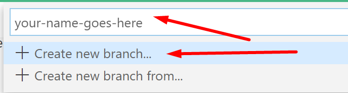
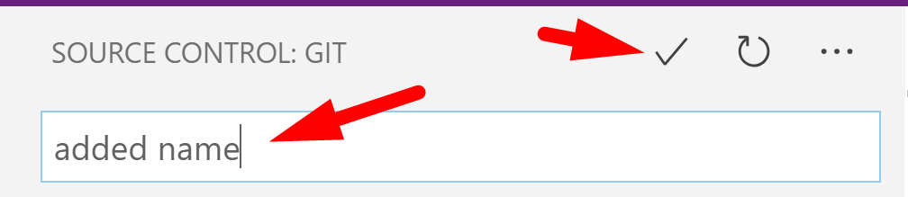

# Chapter 1: Lab 2 - Create branch for your work and practice committing code

## Objectives

* Create your own branch if you havent already
* Create a directory and file to your branch
* Commit changes

## Table of Contents

[Part 1 - Create your own branch for your coursework](#part-1-create-your-own-branch-for-your-coursework)

[Part 2 - Use VS Code to create a WIP directory for your work](#part-2---use-vs-code-to-create-a-wip-directory-for-your-work)

[Part 3 - Using VS Code to commit changes](#part-3---using-vs-code-to-commit-changes)

[Part 4 - BONUS View GitLens extension](#part-4---BONUS-view-gitlens)
 

   
### **Part 1: Create your own branch for your coursework**
[back to top](#table-of-contents)

You will create a branch with your name in this project. It will be tracked by Git so that if you accidentally delete or change files you can recover them easily. (Later we will create an Angular project in this new branch) 

Git is an especially helpful tool while working with Angular. One reason for this is we will be using the Angular CLI tool to create and modify many files at once. 
    
Sometimes, you may accidentally run a command and modify a lot of files you did not mean to. It can be time consuming to clean this up! To make the process easier, and be able to UNDO - we will Git to track our files.
   
1. Depending on your lab setup, the global config for git may or may have not been setup. You can verify this by typing these commands into a command prompt.  These are global settings so you can be in any directory.

    

2. If there are values present, that is all you need for a local Git repo to be able to commit (and more easily discard) your changes.  
    
    It is a good practice to match to the info you would use on a remote repository, such as  GitHub, but it is not required.

3. To set up your personal git username and email idenitifers, use these commands - replacing **John Doe** inside the quotes with your name and **johndoe@example.com** with your email. Again, these are global settings so you can be in any directory.

    

4. Do the following to create a branch in which to do your work.
    * Click the bottom left where it says Master 
   
    
    * choose to create a new branch - use your name
    * 
    * This will now be the branch listed in the lower left corner. Click the cloud icon to push your changes to GitHub.
    

## Part 2 - Use VS Code to create a `WIP` directory for your work
[back to top](#table-of-contents)

1. Ensure that you have the Explorer open in the navigation bar. Recall to click the icon if the view is hidden. See above if you need help.

2. You should see name of the folder displayed in bold,  Ex. `901NODEINTRO`, etc.

3. Create a folder to hold your working files 

    a. If need to see files, click on the Explorer icon in the left navigation bar.

    b. In the empty space at the very bottom of the list, right-click and choose New Folder.

      

    

    c. Name the new folder using WIP and your name...

  

    

### **Part 3 - Using VS Code to Commit Changes**
[back to top](#table-of-contents)

Make sure you are in your branch of the project

1.  Create a new file called **_my_info.txt** by choosing new File icon.
    
   
   
2.  Inside your new **_my_info.txt** file, add your name. 

3.  Click on the Source Control button to open the panel `Source Control`. In this panel, mouse over the README.md file; press the `+` button that appeared to stage the change. You can also stage the change by right clicking on the README.md and clicking `Stage Changes`. You should now see that `README.md` was added to `Staged Changes`

    

4.  Above `Staged Changes` you should see a text input field with the text **Message (press Ctrl+Enter to commit)**. Within this field enter a good commit message which describes the changes we staged in the previous step.

    

5.  Click the check mark above the text message field to commit the changes made to README.md
   

### **Part 4 - BONUS View GitLens** 
[back to top](#table-of-contents)

1.  On VS Code's left hand toolbar, you may see an icon for the  `GitLens` extension you installed earlier. This extension has now been updated to integrate with the Source Control pane. The first time you use it you may need to click on the GitLens icon in the left menu. 

    

    

    

1.  Familiarize yourself with `GitLens'` panel. Notice how you can use it to access different repositories and their branches, remote, your stashes, etc. Also notice how you can navigate through it to see history of a file, a line, or compare files between different branches or between local and remote.

