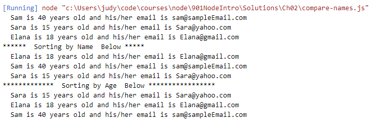

# Chapter 2: Lab 2 Array Practice

## Objectives

* Practice with Array prototype functions

## Steps

1. Create an array of friend objects with properties for age and email. Mix up the data so either property is not sorted in the array.

    ```bat 
    Scroll down for a hint or to continue


    ```

    ```javascript
    let friendsArray = [
        {Name: 'Sam' ,age:40 ,email:  'sam@sampleEmail.com'},
        {Name: 'Sara' ,age:15 ,email: 'Sara@yahoo.com'},
        {Name: 'Elana' ,age:18 ,email: 'Elana@gmail.com'}
    ];
    ```

1. Print the array, then sort by name in ascending order and print, and then sort by age in ascending order and print. Your output should look similar to the following.

  
