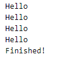

# Chapter 2: Lab 3 Arrow Functions and Timers

## Objectives

* Practice with timers and asynchronous code

## Steps

1. Continue working in your js folder. 
   
2. Create a file called timer-practice.js
   
3. In this file create an interval function that prints Hello every second that cancels after 5 seconds with a message of Finished!. Example output:

  

```txt 
        Scroll down for a hint or to continue


   
```
Hints:

1. use the setInterval function. 
   1. The first argument is the function to execute. You can use an arrow function with a console.log. Remember ES6 Snippets allows you to type **clg** to quickly write out console.log()
   2. The second and last argument is 1000 to represent 1 second
   3. Recall that the setInterval function returns a timerId - save this off to a variable in order to call clearInterval

2. use setTimeout with:
   1. the 1st argument being the call to clearInterval with the timerId
   2. the 2nd argument being 5000 to represent 5 seconds


1. Mark your work as complete using the means specified for your class. Then work on the bonuses for this chapter.
