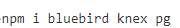

# Chapter 5 Practice with Postgres
## Objectives:
* You will practice working wth Postgres
* Review the code in /Demos/Ch05-DBAccess/simple-examples as you complete the steps

## Directory and files

1. In your `\WIP` directory, create your working directory: `\WIP\Ch06\`

1. In this directory, create a file called `database-practice.js`


## Steps

1. In the new Ch06 directory, create a `package.json` file using `npm init -y`.

1. Use `npm install` to add dependencies of `bluebird` and `knex` and `pg`

    

1. Modify the `database-practice.js` file to require:
    ```javascript
    const Promise = require("bluebird");
    const knex = require("knex");
    let db = knex(require("./knexfile"));
    ```

2. In your working directory, create a `knexfile.js` in order to connect to the database called `practice` 

    ```javascript
    module.exports = {
        client: "pg",
        connection: {
            host: "localhost",
            user: "postgres",
            password: "root",
            database: "practice"
        }
    };
    ```

3. Open the PgAdmin (or other) client program to work with Postgres.

4. If you did not already create it during the demos, create the database called `practice`.

5. Add code to the `database-practice.js` file to create a table called `customer`, with fields for `firstname`, `lastname` and `email`.

6. Add two records to this table.

7. Select the records and display them in the console.

8.  Execute your new code and view console. you can also look in the database for the created records.