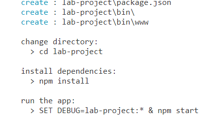
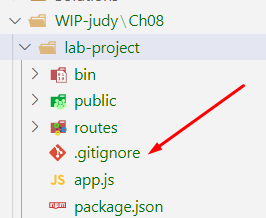
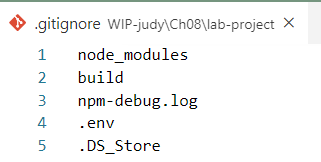
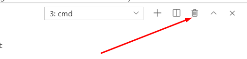
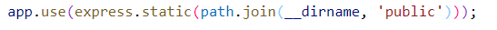
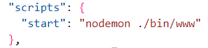
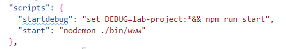
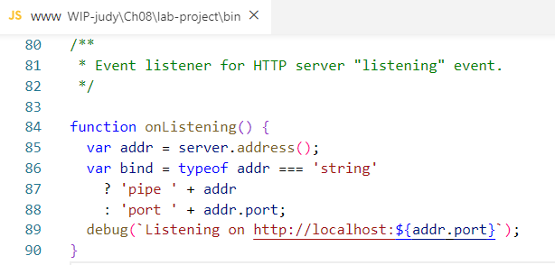
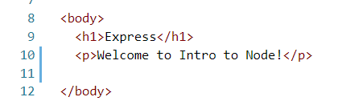

# Chapter 8 Lab 1: Create a new project

## Objectives

* Create a new project for the course using Express App Generator
* Customize some of the default setup

## Steps

### Create new project

1. Create a new directory now at `WIP/Ch08/express1`

1. You can either install Express application generator globally or use npx to run it one time with the latest version from npmjs.org. To install globally
   
    `npm install express-generator -g`

2. Execute one of these commands to create the lab-project
    
    ```express --no-view lab-project && cd lab-project``` 
   
1. Notice the output indicates how to start the application. We have already issues a cd so we can look at next steps.

    


2. Before npm installing - let's add a .gitignore file to your project to not track the node_modules.

    

3. Add entries to this file for the folder node_modules, the build directory, log files, environment files and for Mac users .DS_store
   
    

4. Commit your project with a commit message of "initial commit"

5. Execute the command `npm install` if you have ignored the node_modules folder correctly you will not be tracking the files in the newly created node_modules.

6. Look at the "start" script in package.json, how is this Node app started?

7. The script runs **node `./bin/www`**. This **www** file requires `app.js`. We will mostly be working within app.js.


8.  Run **npm start**.  If you already have another server running on the same port you will get a message that the port is in use. If so shut down the other servers, by clicking the garbage can in VS Code terminal view, then run **npm start** again.

    

9.  Visit the site at http://localhost:3000. Your app should now be up and running. You can control click this link in the readme if on the same machine as where you are working.
    
10. What html file is being loaded in the browser and how? The **index.html** Is defined in the public folder. This was exposed by this line in app.js. App.use is an example of middleware. This line of code is one reason Express is so popular. To quickly create an http server for testing front end code. 

    


11. In VS Code you can use the icons pictured above:
    * Hit the trashcan icon to kill process and close the window
    * Hit the X to hide the window, and use Ctrl-` to get it back
    * Ctrl-C to stop the process and stay in the same directory


12. Modify the start script to restart on changes using nodemon. (ensure nodemon is installed globally)

    


    ### Modify initial setup of new project

13. If you havent already, install `nodemon` globally. This way you can start projects using `nodemon` - which will automatically restart the server when you make file changes. **npm i -g nodemon**

14. We want to turn on debugging in Express. To do so, we need to set an environment variable. We can put this as an npm script entry to save on typing. Update scripts to include **setdebug** and to use **nodemon** when starting the server.


    

15. Now use the new script to start. You musty use the word run since this is not longer the commonly used start script. Use the command **npm run startdebug**
  

16. Add a nicer console.log to the `./bin/www` file which lists the complete URL to make it easer to click through to the start of the application.   While testing your changes you need to stop and restart the server to get it to reread the www file.

    

17. Stop/Restart the server is it still working?
    
18. Now modify the public/index.html file to display a different message. You should be able to save your changes and refresh the browser to see your changes.

    


