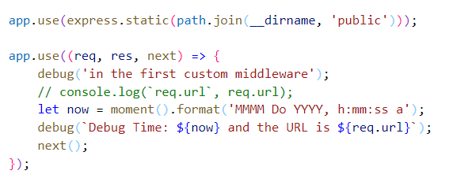
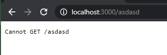
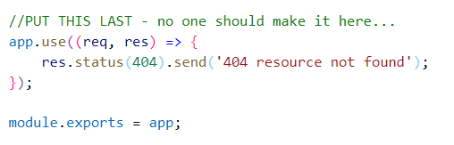
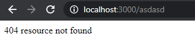
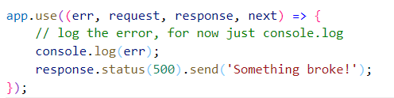
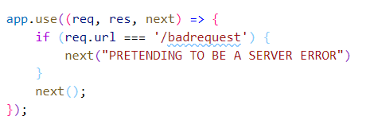

# Chapter 8 Lab 2: Add middleware

## Objectives

* Add the use of middleware to the Express project
* 

## Steps


1. Continue in the project created at `WIP/Ch08/express1`. If you need to - copy the solution from the last lab as your starting point.

1. Add the moment package to the project: **npm i moment**

1. Enable the use of moment and debug in the **app.js** module by adding require statements at the top of this file.

    ```javascript
        const moment = require('moment');
        const debug = require('debug')('lab-project:server');
    ```

2. After the midleware that was created for you - that uses express.static - add middleware that for every incoming request - the current time is logged with the request url.

    


1. If nodemon was setup correctly in last exercise, when you make changes the server should restart. Stop/Restart the server if it is not running.Use the command **npm run startdebug**   
1. The URL to http://localhost:3000 simple loads the index.html. 

2. Use the URL http://localhost:3000/asdasd
 
1. You should see your debug statements printing.

1. The browser will show :
   
   

2. Add middleware which is after everything else before the module.exports. If no path matches that returns anything this will give a 404 resource not found.

    


2. Use the URL again http://localhost:3000/asdasd and you should see a 404 error.
   
    
 
1. Now, add middleware that is for error handling. Add this code before the module.exports.

    

1. The middleware is triggered if we raise an error by calling next() with an argument for the error. Add this middleware  before your 404 check code you just added.

    

1. Test the code by going ot the url http://localhost:3000/badrequest  you should see the something broke message. Check the Node console. You should see the error.


