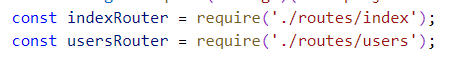
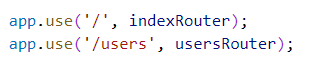
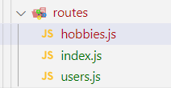
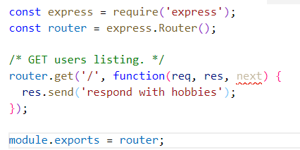
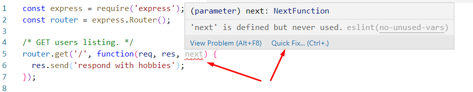
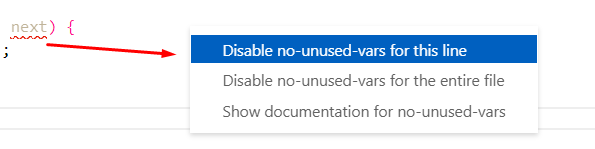
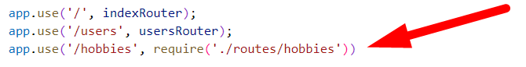
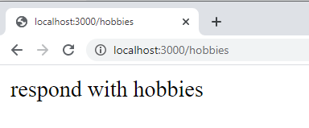

# Chapter 8 Lab 3: Add Routes

## Objectives

* Practice adding routes in Express
  

## Steps


1. Notice in app.js the inclusion of these statements that were added by the express app generator: (these have been updated to use const instead of var)
   
    

1. Lower in **app.js**, middleware is used to include these route files. The difference between the two, is that /users must be apart of the **req.url** for the routes in usersRouter to be looked at.

    

1. Open the **index.js** file. Add another route in for /about.

    ```javascript
    router.get("/about", (req, res) => {
        res.send("Hello world! From GET /about route");
    });
    ```
1. If the server is not running start it. Use the command **npm run startdebug**

1. You should now be able to hit this route in the browser at http://localhost:3000/about Test that you can see it.

1. In the routes directory create another file called hobbies.js.
    


2. You can copy the content from **users.js** file but update it to be as shown with a message about hobbies.
    

1. If you wish you can get rid of the warning about next not being used by hovering and choosing to comment out for this line.

    

    

   
1. Update the **app.js** file to include this route by adding this line to require the new file.

    

1. Test and see that if you go to http://localhost:3000/hobbies that you see the expected message.

    

