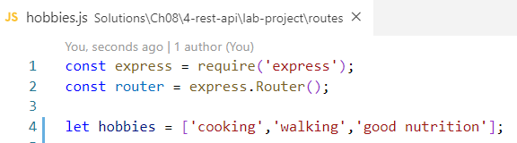
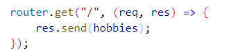
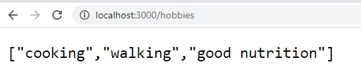
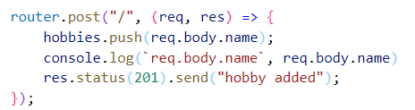
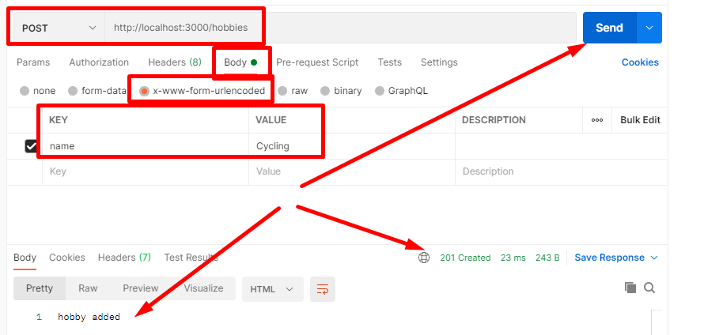

# Chapter 8 Lab 4: Create a Rest Api

## Objectives

* Add Get, Post, Put, Delete for Hobbies
  
## Steps

1. Continue in the project created at `WIP/Ch08/express1`. If you need to - copy the solution from the last lab as your starting point.

2. In the **hobbies.js** routes file create an array called hobbies using the let keyword and list 3 strings. You can place it after the imports.

    

3. Update the get route for hobbies to send back the array.

    

1. Test that the GET request works by using the browser:

    

4. Now create a post route to add a new hobby. 

    

1. To test this we can use PostMan. Be sure to put in the url, choose Post, Select Body, and x-www-form-urlencoded, and give a key/value of name with the name of the hobby.

    

1. If you rerun the get request in postman you should now see all hopbbies.

# Bonus

1. Create the Delete and Put routes.